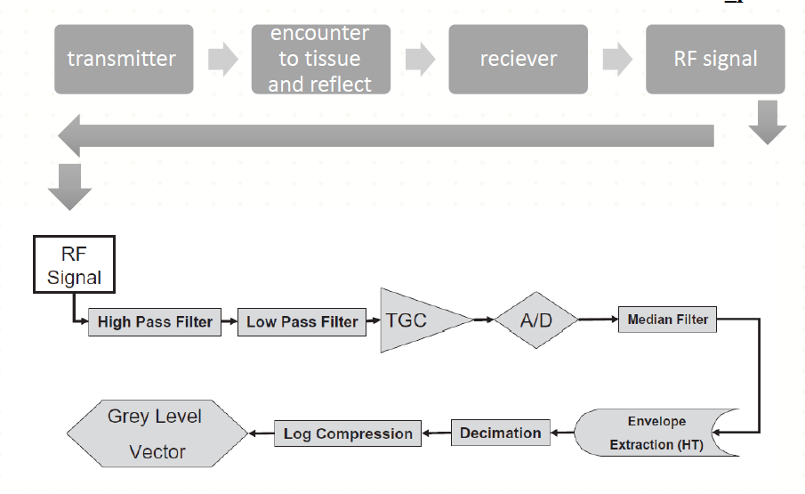
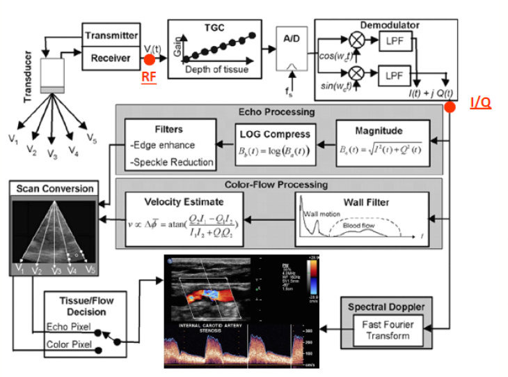
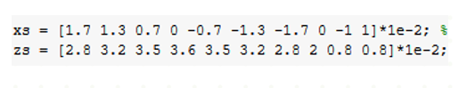
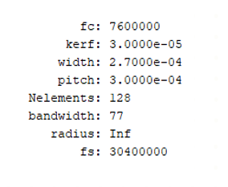
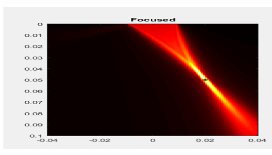
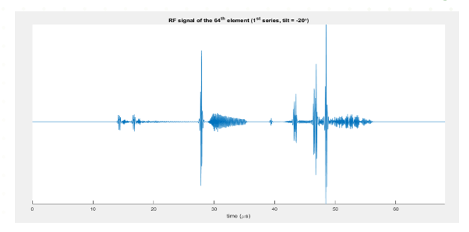
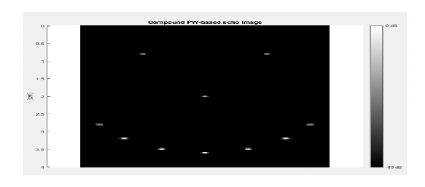

# echocardiogrphy
making image and image processing in echocardiography

### Echocardiography is one of the best and cheapest and less hazardous techniques for imaging of heart 

In this technique we are using ultrasound waves to transfer it to heart and by using of returned waves we can construct a image of heart

#### schematic of process

#### schematic of RF to B-MODE imaging

in this project we want to use a toollbox "MUST" in Matlab to simulate of how to produce a RF signal and how convert it to a 2D image

 
      site : http://www.biomecardio.com/MUST/examples.html         

   

 
## simulation

### 1-defining of scatters 

  

### 2-defining parameters of physical instruments

   

### 3-simulation of phased array probe

   

### 4-simulation of RF signal 

   

### 5-converting of RF signal to B-mode image

   
